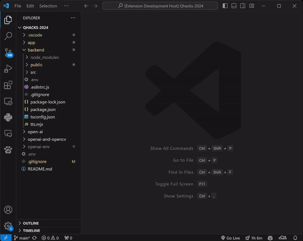
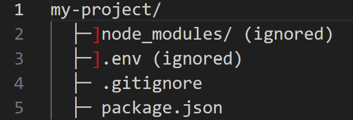

# File Structure Tree

Generates file trees of your project's directories, with an output similar to the `tree` command in Windows.

## Features

- Ignores your .git directory and the patterns in your .gitignore
  > This means this extension won't print out your whole .git or node_modules directory.
  > 
- Supports multiple .gitignore files nested in your workspace
- Highlights your ignored files, which can for debugging which files your .gitignore is targeting.
- Compatible with windows and posix-style file systems

## Use Cases

- Viewing entire source code uncollapsed
- Troubleshooting .gitignore pattern matching
- Pasting output into chat completion AI (such as ChatGPT) to give it context for project structure